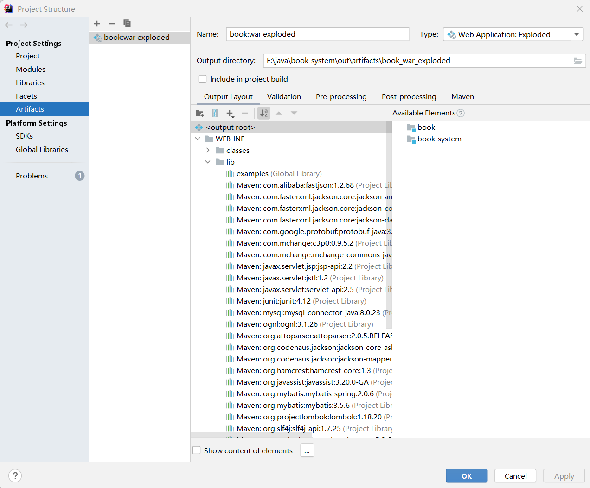
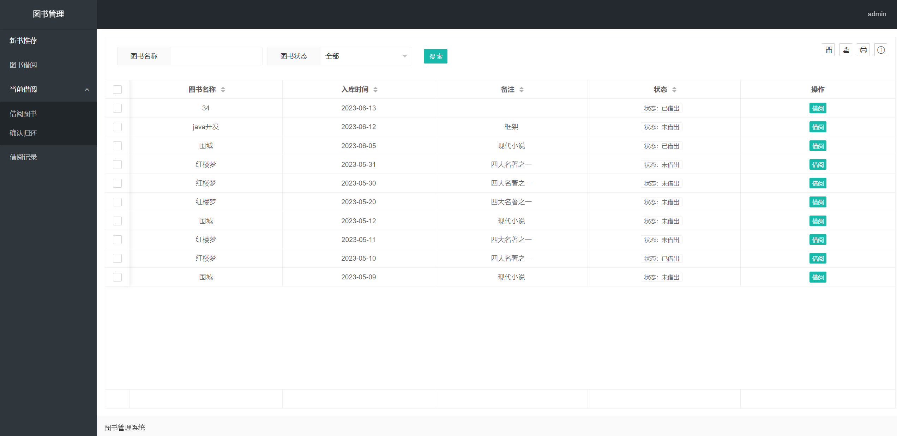
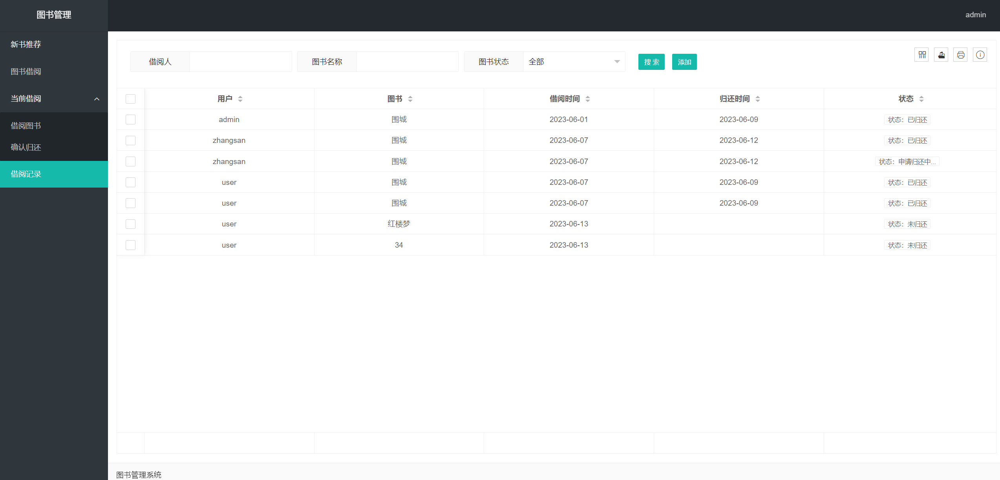

# bookSystem

#### 介绍
图书管理系统简单使用

#### 软件架构
主要涉及mybatis+spring MVC+thymeleaf 技术，同时使用了拦截器对url的访问进行权限控制

#### 安装教程

1.  git 项目后，需要选择file->project Structure->artifacts,选择在WEB-INF中添加lib目录，并在lib目录下添加使用的依赖，结果如下图所示
    

#### 使用说明

1.  登录
    
2.  图书管理界面
    
3.  借阅记录
    
    
#### 打赏

觉得项目不错，可以点小星星或者打赏，感谢！

